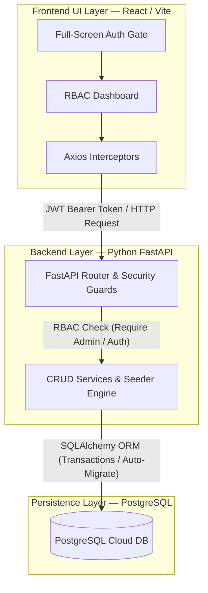

<div align="center">

# ⚡ Inventory.sys Enterprise
### Enterprise Role-Based Access Control (RBAC) Inventory & Order Management Portal

[](https://inventory-management-system-lilac-nine.vercel.app/)
[](https://inventory-backend-api-9aya.onrender.com/)
[](https://inventory-backend-api-9aya.onrender.com/docs)
[](https://hub.docker.com/repository/docker/raghavparasher/inventory-backend/general)

[](https://react.dev/)
[](https://vitejs.dev/)
[](https://www.python.org/)
[](https://fastapi.tiangolo.com/)
[](https://www.postgresql.org/)
[]()

<p align="center">
  A full-stack, state-of-the-art SaaS inventory and logistics portal featuring strict Role-Based Access Control (RBAC), atomic database transactions, glassmorphic UI aesthetics, and instant self-healing cloud credentials.
</p>

</div>

---

## 🌐 Live Production Deployments

Explore the complete, live enterprise application with one click:

| Service Layer | Live Deployment URL | Description |
| :--- | :--- | :--- |
| **🎨 Frontend Portal** | **[Vercel Live Application](https://inventory-management-system-lilac-nine.vercel.app/)** | Full-Screen Authentication Gate & Glassmorphic RBAC Dashboard |
| **⚡ Backend API** | **[Render Cloud Server](https://inventory-backend-api-9aya.onrender.com/)** | High-Performance FastAPI Python REST API Server |
| **📚 Interactive Docs** | **[Swagger UI OpenAPI](https://inventory-backend-api-9aya.onrender.com/docs)** | Interactive API Sandbox & Documentation |
| **🐳 Docker Hub** | **[Production Image](https://hub.docker.com/repository/docker/raghavparasher/inventory-backend/general)** | Optimized Multi-Stage Docker Container Registry |

---

## 👑 Role-Based Access Control (RBAC) & One-Click Demo Portal

**Inventory.sys Enterprise** enforces strict dual-tier authentication (`JWT Bearer Tokens` + `Direct Bcrypt Verification`) across both the user interface and secure API endpoints.

When visiting the application, users are greeted by our full-screen **Authentication Gate** featuring **⚡ One-Click Quick Demo Access** cards that require zero typing:

| Role Badge | Demo Credentials | Access Mode | Granted Privileges & Security Restrictions |
| :---: | :---: | :---: | :--- |
| **👑 System Admin** | `admin` / `admin123` | **Executive Mode** | **Full System Authority**: Complete visibility into revenue valuations ($ USD), catalog creation & deletion rights, full customer PII access (`email`, `phone`), and executive order management. |
| **📦 Warehouse Staff** | `warehouse` / `stock2026` | **Logistics Mode** | **Logistics & Stock Control**: Can add/edit stock quantities and process shipments. **Locked Features**: Financial revenue metrics are hidden, catalog deletion is blocked (`HTTP 403 Forbidden`), and customer PII is automatically masked (`***@protected.sys`). |

> [!TIP]
> **Auto-Healing Cloud Database**: Our backend features an intelligent self-healing mechanism (`ensure_schema_columns` + `bcrypt wrapper`). If demo account credentials or database schemas ever drift across cloud deployments, the system automatically migrates tables and resets demo hashes silently on boot or during login.

---

## 💎 Core Architectural Highlights

### 1. Full-Screen Glassmorphic Authentication Gate
- **Zero-Friction Access**: Visitors see a dedicated SaaS landing gate with vibrant gradient cards for instant evaluation.
- **Dynamic Role Switching**: Authenticated users can smoothly switch between **👑 System Admin** and **📦 Warehouse Staff** modes directly from the interactive sidebar widget.

### 2. Intelligent Catalog Management & Categorization
- **Pre-Seeded Enterprise Catalog**: Comes ready with **55+ high-tech products** categorized across 5 core IT sectors:
  - `💻 Computing & Displays` (MacBook Pro, UltraSharp Monitors, Workstations)
  - `🌐 Network Infrastructure` (Cisco Switches, Meraki Gateways, Wi-Fi 6E Access Points)
  - `💾 Storage & Servers` (Synology NAS, NVMe Enterprise SSDs, Dell PowerEdge)
  - `⌨️ Peripherals` (Logitech MX Master, Mechanical Keyboards, Conference Webcams)
  - `⚡ Power & Backup` (APC Smart-UPS, Rack PDU, Surge Protectors)
- **Category Filter Tabs**: Instantly filter and sort products across categories with live unit count badges.

### 3. Financial Revenue Valuation & Atomic Order Engine
- **Live Inventory Valuation**: Dynamically calculates the total asset value ($\sum \text{Price} \times \text{Quantity}$) across the entire inventory catalog in real-time.
- **Atomic Stock Decrement (`SELECT FOR UPDATE`)**: Placing an order securely validates available quantities on the backend, deducts inventory atomically, and calculates order totals to guarantee transaction integrity without race conditions.

### 4. Data Privacy & PII Protection
- Strict separation of concerns ensures that **Warehouse Logistics Staff** cannot view sensitive customer personal identifiable information (PII) or financial revenue metrics, adhering to enterprise data compliance standards.

---

## 🛠️ System Architecture & Data Flow



### Technology Stack Details
- **Frontend Core**: React 18, React Router v6, Axios with automatic token interceptors, and custom Glassmorphism CSS design system.
- **Backend API**: Python 3.11, FastAPI (async execution), Pydantic v2 validation, PyJWT, and direct `bcrypt` password encryption.
- **Database ORM**: SQLAlchemy with declarative models and automated PostgreSQL schema column synchronization.

---

## 🐳 How to Run Locally with Docker Compose

You can spin up the full-stack application (`Frontend + Backend + PostgreSQL Database`) on any local machine in seconds using Docker Compose.

### Prerequisites
- [Docker & Docker Desktop](https://docs.docker.com/get-docker/) installed.

### Quick Start Instructions

1. **Clone the repository:**
   ```bash
   git clone https://github.com/RaghavParasher/inventory-management-system.git
   cd inventory-management-system
   ```

2. **Launch the entire stack:**
   ```bash
   docker-compose up --build
   ```

3. **Access your local instances:**
   - **🎨 Frontend Portal:** `http://localhost:5173`
   - **⚡ Backend REST API:** `http://localhost:8000`
   - **📚 Interactive Swagger Docs:** `http://localhost:8000/docs`

4. **Stop the stack:**
   ```bash
   docker-compose down
   ```

---

<div align="center">
  <p>Built with precision for world-class software engineering excellence.</p>
</div>
